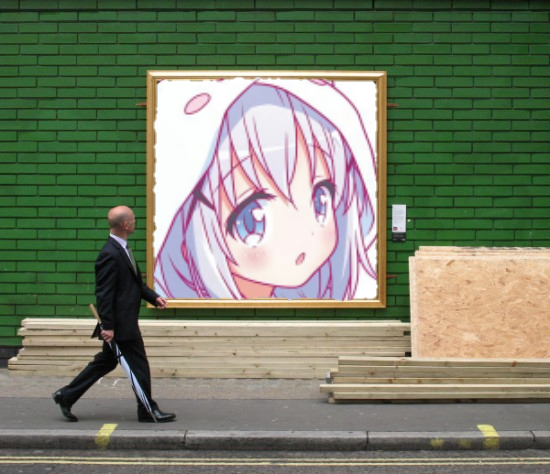
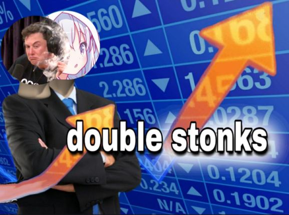

<a href="https://nodei.co/npm/imange/"></a>

# imange

A powerfull module that allow you to generate awesome images. This is an extension to discord-image-genration with a bunch more functions. :P


You can download it from <a href="https://www.npmjs.com/package/imange">npmjs</a>.

# Configuration
First install it using either
```cli
npm i imange --save
```
or
```cli
yarn add imange
```

Now create a script in your discord.js project with the name of the image effect you want to have for eg: `bobross.js`

Now make your usual command handler stuff and then import imange and discord's Message Attachment as so:
```js
const imange = require("imange")
const { MessageAttachment } = require("discord.js")
```
Then add the effect itself:
```js
const img = await new imange.[[EFFECT]]().getImage(
    message.author.displayAvatarURL(
        { dynamic: false,
         format: "png" 
        }
    )
);
const attach = new MessageAttachment(img, "[[EFFECT]].png");
return message.channel.send(attach);
```
Replace the [[EFFECT]] with the name of one of the effects stated below
Eg: 
```js
const img = await new imange.Ad().getImage(
    message.author.displayAvatarURL(
        { dynamic: false,
         format: "png" 
        }
    )
);
const attach = new Discord.MessageAttachment(img, "ad.png");
return message.channel.send(attach);
```
Result: 


Some effects require more than one input for these you will have to give it more of them as such:

```js
const img = await new imange.DoubleStonk().getImage(
    message.author.displayAvatarURL(
        { dynamic: false,
         format: "png" 
        },
    message.mentions.users.first().displayAvatarURL(
        { dynamic: false,
         format: "png" 
        }
)
const attach = new Discord.MessageAttachment(img, "ad.png");
return message.channel.send(attach);
```
> Not how the DoubleStonk().getImage has been provided with two user avatars!

Result:

<br>
# Effect List

|  Type   | No. images required |   Effect Name    |
| :-----: | :-----------------: | :--------------: |
|   PNG   |          1          |        Ad        |
|   PNG   |          1          |      Affect      |
|   PNG   |          1          |     Approved     |
|   PNG   |          1          |    Beautiful     |
|   PNG   |          1          |      Biden       |
|   PNG   |          1          |      Trump       |
|   PNG   |          1          |     Bobross      |
|   PNG   |          1          |     Captcha      |
|   PNG   |          1          |  ConfusedStonk   |
|   PNG   |          2          |   DoubleStonk    |
|   PNG   |          1          |     NotStonk     |
|   PNG   |          1          |      Stonk       |
|   PNG   |          1          |     Facepalm     |
|   PNG   |          1          |      Hitler      |
|   PNG   |          1          |       Jail       |
|   PNG   |          1          |      Karaba      |
|   PNG   |          2          |       Kiss       |
|   PNG   |          1          |  ConfusedStonk   |
|   PNG   |          1          |       Mms        |
|   PNG   |          1          |      Money       |
|   PNG   |          3          |      Podium      |
|   PNG   |          1          |     Poutine      |
|   PNG   |          1          |       Rip        |
|   PNG   |          2          |      Spank       |
|   PNG   |          1          |      Tattoo      |
|   PNG   |          1          |      Thomas      |
|   PNG   |          1          |      Trash       |
|   PNG   |          1          |      Wanted      |
|   PNG   |          1          |      Crush       |
|   PNG   |          1          |      Delete      |
|   PNG   |          1          |   DiscordBlack   |
|   PNG   |          1          |   DiscordBlue    |
|   PNG   |          2          |     Bat Slap     |
|   PNG   |          2          |       Bed        |
|   PNG   |          3          |    Distracted    |
|  TEXT   |          0          | LisaPresentation |
|   GIF   |          1          |     Trigger      |
|   GIF   |          2          |      Blink       |
| FILTERS |          1          |       Blur       |
| FILTERS |          1          |       Gay        |
| FILTERS |          1          |    Greyscale     |
| FILTERS |          1          |      Invert      |
| FILTERS |          1          |     Lesbian      |
| FILTERS |          1          |    Nonbinary     |
| FILTERS |          1          |      Sepia       |


